<h2>
EfficientDet-MRI-Brain-Tumor (Updated: 2023/05/18)
</h2>
This is an experimental project to detect <b>Brain-Tumor</b> based on 
Brain MRI segmentation, by using Google Brain AutoML
<a href="https://github.com/google/automl/tree/master/efficientdet"> EfficientDet.</a> 
The segmentation image dataset used here has been taken from the following  web site: 

 
<b>Brain MRI segmentation</b> 
<pre>
https://www.kaggle.com/datasets/mateuszbuda/lgg-mri-segmentation
</pre>

About Dataset 
LGG Segmentation Dataset 
Dataset used in: 

Mateusz Buda, AshirbaniSaha, Maciej A. Mazurowski "Association of genomic subtypes of 
lower-grade gliomas with shape features automatically extracted by a deep learning 
algorithm." Computers in Biology and Medicine, 2019.
and
Maciej A. Mazurowski, Kal Clark, Nicholas M. Czarnek, Parisa Shamsesfandabadi, 
Katherine B. Peters, Ashirbani Saha "Radiogenomics of lower-grade glioma: 
algorithmically-assessed tumor shape is associated with tumor genomic subtypes 
and patient outcomes in a multi-institutional study with 
The Cancer Genome Atlas data." Journal of Neuro-Oncology, 2017.

This dataset contains brain MR images together with manual FLAIR abnormality 
segmentation masks.
The images were obtained from The Cancer Imaging Archive (TCIA).
They correspond to 110 patients included in The Cancer Genome Atlas (TCGA) 
lower-grade glioma collection with at least fluid-attenuated inversion recovery (FLAIR) 
sequence and genomic cluster data available.
Tumor genomic clusters and patient data is provided in data.csv file.

<h2>
1. Installing tensorflow on Windows11
</h2>
We use Python 3.8.10 to run tensoflow 2.10.1 on Windows11. 
<h3>1.1 Install Microsoft Visual Studio Community</h3>
Please install <a href="https://visualstudio.microsoft.com/ja/vs/community/">Microsoft Visual Studio Community</a>, 
which can be ITed to compile source code of 
<a href="https://github.com/cocodataset/cocoapi">cocoapi</a> for PythonAPI. 
<h3>1.2 Create a python virtualenv </h3>
Please run the following command to create a python virtualenv of name <b>py38-efficientdet</b>.
<pre>
>cd c:\
>python38\python.exe -m venv py38-efficientdet
>cd c:\py38-efficientdet
>./scripts/activate
</pre>
<h3>1.3 Create a working folder </h3>
Please create a working folder "c:\google" for your repository, and install the python packages. 

<pre>
>mkdir c:\google
>cd    c:\google
>pip install cython
>git clone https://github.com/cocodataset/cocoapi
>cd cocoapi/PythonAPI
</pre>
You have to modify extra_compiler_args in setup.py in the following way:
<pre>
   extra_compile_args=[]
</pre>
<pre>
>python setup.py build_ext install
</pre>

 
<h2>
2. Installing EfficientDet-MRI-Brain-Tumor
</h2>
<h3>2.1 Clone repository</h3>
Please clone EfficientDet-MRI-Brain-Tumor.git in the working folder <b>c:\google</b>. 
<pre>
>git clone https://github.com/sarah-antillia/EfficientDet-MRI-Brain-Tumor.git 
</pre>
You can see the following folder <b>projects</b> in EfficientDet-MRI-Brain-Tumor of the working folder. 

<pre>
EfficientDet-MRI-Brain-Tumor
└─projects
      └─MRI-Brain-Tumor
          ├─eval
          ├─saved_model
          ├─test
          ├─test_outputs
          ├─train
          └─valid
</pre>
<h3>2.2 Install python packages</h3>

Please run the following command to install python packages for this project. 
<pre>
>cd ./EfficientDet-MRI-Brain-Tumor
>pip install -r requirements.txt
</pre>

 
<h3>2.3 Create TFRecord dataset</h3>
<h3>
2.3.1. Download Brain MRI segmentation
</h3>
Please download LGG-MRI-Segementation image dataset from the following link. 
<pre>
https://www.kaggle.com/datasets/mateuszbuda/lgg-mri-segmentation
</pre>

<b>lgg-mri-segmentation</b> dataset has the following folder structure. 
<pre>
lgg-mri-segmentation
└─kaggle_3m
    ├─TCGA_CS_4941_19960909
    ├─TCGA_CS_4942_19970222
    ├─TCGA_CS_4943_20000902
    ├─TCGA_CS_4944_20010208
    ├─TCGA_CS_5393_19990606
     ...
    ├─TCGA_HT_A5RC_19990831
    ├─TCGA_HT_A616_19991226
    ├─TCGA_HT_A61A_20000127
    └─TCGA_HT_A61B_19991127
</pre>
<h3>
2.3.2 Split master dataset
</h3>
We have split Brain-Tumor dataset to <b>train</b> and <b>test</b> dataset 
by using Python <a href="./projects/MRI-Brain-Tumor/split_master.py">split_master.py</a> script.
<pre>
BrainTumor-Segmentation
├─test
│  ├─image
│  └─mask
└─train
    ├─image
    └─mask
</pre>
<h3>
2.3.3 Split train to train and valid 
</h3>
We have split <b>BrainTumor-Segmentation/train</b> dataset to train and valid by using Python
<a href="./projects/MRI-Brain-Tumor/split_train.py">split_train.py</a> scripts. 
This script will perform the following image processings. 
1 Resize all tif files in the orignal dataset to 512x512. 
2 Convert the tif files in <b>image</b> folders to jpg files. 
3 Convert the tif files in <b>mask </b> folders to png files. 
 

<pre>
BrainTumor
├─test
│  ├─image
│  └─mask
├─train
│  ├─image
│  └─mask
└─valid
    ├─image
    └─mask
</pre>
<h3>
2.3.4. Create YOLO annotation
</h3>
 We have created <b>YOLO-BrainTumor</b> annotation dataset from <b>train</b>, <b>valid</b> and <b>test</b> dataset of <b>BrainTumor</b> by using the following Python script. 
<a href="./projects/MRI-Brain-Tumor/YOLOAnnotationGenerator.py">YOLOAnnotationGenerator.py</a> 

<pre>
./YOLO-BrainTumor/
├─test
├─train/
└─valid/
</pre>

<h3>
2.3.5. Convert YOLO to TFRecord
</h3>
 We have created <b>TFRecord</b> dataset from <b>MRI-Brain-Tumor YOLO</b> train and valid dataset by using 
 <a href="https://github.com/sarah-antillia/AnnotationConverters/blob/main/YOLO2TFRecordConverter.py">YOLO2TFRecordConverter.py </a>.
 

<h3>
2.3.6. Convert YOLO to COCO
</h3>
 We have also created <b>COCO</b> annotation test dataset from <b>MRI-Brain-Tumor YOLO</b> test dataset by using 
 <a href="https://github.com/sarah-antillia/AnnotationConverters/blob/main/YOLO2COCOConverter.py">YOLO2COCOConverter.py </a>.
 
The generated test dataset will be used to evaluate detection accuracy (mAP) of our MRI-Brain-Tumor EfficientDet Model.
 
<h3>
2.3.7. Insepect TFRecord
</h3>
 Please run the following bat file to inspect TFRrecord/train dataset. 
 <pre>
tfrecord_inspect.bat
 </pre>
 
 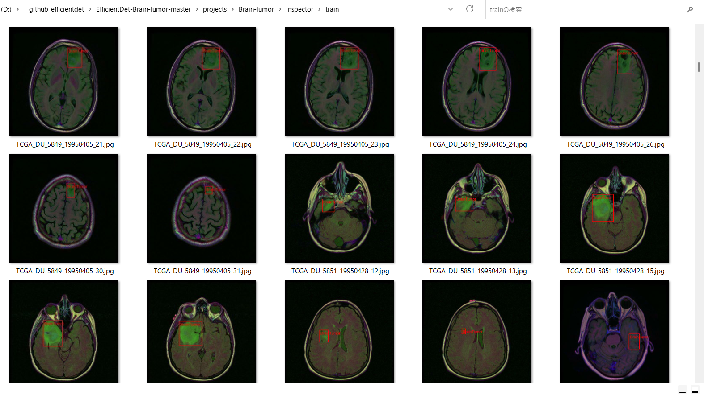 
  
 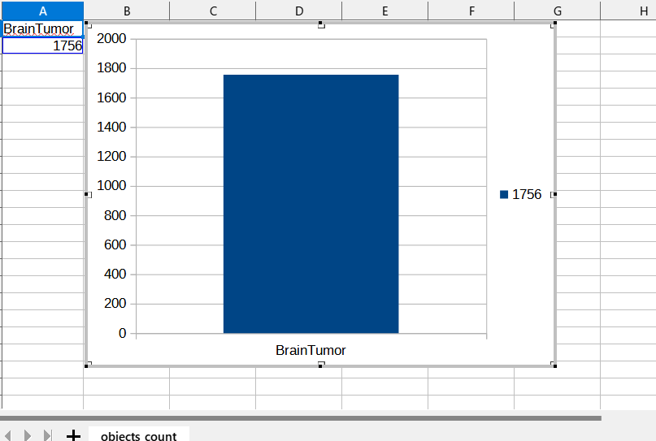 
 
<!--
<h3>2.4 Workarounds for Windows</h3>
As you know or may not know, the efficientdet scripts of training a model and creating a saved_model do not 
run well on Windows environment in case of tensorflow 2.8.0 (probably after the version 2.5.0) as shown below:. 
<pre>
INFO:tensorflow:Saving checkpoints for 0 into ./models\model.ckpt.
I0609 06:22:50.961521  3404 basic_session_run_hooks.py:634] Saving checkpoints for 0 into ./models\model.ckpt.
2022-06-09 06:22:52.780440: W tensorflow/core/framework/op_kernel.cc:1745] OP_REQUIRES failed at save_restore_v2_ops.cc:110 :
 NOT_FOUND: Failed to create a NewWriteableFile: ./models\model.ckpt-0_temp\part-00000-of-00001.data-00000-of-00001.tempstate8184773265919876648 :
</pre>

The real problem seems to happen in the original <b> save_restore_v2_ops.cc</b>. The simple workarounds to the issues are 
to modify the following tensorflow/python scripts in your virutalenv folder. 
<pre>
c:\py38-efficientdet\Lib\site-packages\tensorflow\python\training
 +- basic_session_run_hooks.py
 
634    logging.info("Saving checkpoints for %d into %s.", step, self._save_path)
635    ### workaround date="2022/06/18" os="Windows"
636    import platform
637    if platform.system() == "Windows":
638      self._save_path = self._save_path.replace("/", "\\")
639    #### workaround
</pre>

<pre>
c:\py38-efficientdet\Lib\site-packages\tensorflow\python\saved_model
 +- builder_impl.py

595    variables_path = saved_model_utils.get_variables_path(self._export_dir)
596    ### workaround date="2022/06/18" os="Windows" 
597    import platform
598    if platform.system() == "Windows":
599      variables_path = variables_path.replace("/", "\\")
600    ### workaround
</pre>
 
<h3>3. Inspect tfrecord</h3>
  Move to ./projects/IT_RoadSigns directory, and run the following bat file: 
<pre>
tfrecord_inspect.bat
</pre>
, which is the following:
<pre>
python ../../TFRecordInspector.py ^
  ./train/*.tfrecord ^
  ./label_map.pbtxt ^
  ./Inspector/train
</pre>
 
This will generate annotated images with bboxes and labels from the tfrecord, and cout the number of annotated objects in it. 
 
<b>TFRecordInspecotr: annotated images in train.tfrecord</b> 

 
 
<b>TFRecordInspecotr: objects_count train.tfrecord</b> 

 
This bar graph shows that the number of the objects contained in train.tfrecord.
 
 
 
<h3>4. Downloading the pretrained-model efficientdet-d0</h3>
Please download an EfficientDet model chekcpoint file <b>efficientdet-d0.tar.gz</b>, and expand it in <b>EfficientDet-IT-RoadSigns</b> folder. 
 
https://storage.googleapis.com/cloud-tpu-checkpoints/efficientdet/coco2/efficientdet-d0.tar.gz
 
See: https://github.com/google/automl/tree/master/efficientdet 
-->

<h3>3. Training MRI-Brain-Tumor Model by using the pretrained-model</h3>
Please change your current directory to <b>./projects/MRI-Brain-Tumor</b>,
and run the following bat file to train MRI-Brain-Tumor EfficientDet Model by using the train and valid tfrecords.
<pre>
1_train.bat
</pre>

<pre>
rem 1_train.bat
python ../../ModelTrainer.py ^
  --mode=train_and_eval ^
  --train_file_pattern=./train/*.tfrecord  ^
  --val_file_pattern=./valid/*.tfrecord ^
  --model_name=efficientdet-d0 ^
  --hparams="autoaugment_policy=v2,image_size=512x512,num_classes=1,label_map=./label_map.yaml" ^
  --model_dir=.\models ^
  --label_map_pbtxt=./label_map.pbtxt ^
  --eval_dir=./eval ^
  --ckpt=../../efficientdet-d0  ^
  --train_batch_size=4 ^
  --early_stopping=map ^
  --patience=10 ^
  --eval_batch_size=4 ^
  --eval_samples=100  ^
  --num_examples_per_epoch=400 ^
  --num_epochs=100
</pre>
Please note that we use <b>autoaugment_policy=v2</b> in --hparams. 
On detail of autoaugment_policy, see <a href="https://github.com/tensorflow/examples/blob/master/tensorflow_examples/lite/model_maker/third_party/efficientdet/aug/autoaugment.py">autoaugment.py</a> 
<table style="border: 1px solid #000;">
<tr>
<td>
--mode</td><td>train_and_eval</td>
</tr>
<tr>
<td>
--train_file_pattern</td><td>./train/*.tfrecord</td>
</tr>
<tr>
<td>
--val_file_pattern</td><td>./valid/*.tfrecord</td>
</tr>
<tr>
<td>
--model_name</td><td>efficientdet-d0</td>
</tr>
<tr><td>
--hparams</td><td>
"autoaugment_policy=v2,image_size=512x512,num_classes=1,label_map=./label_map.yaml"
</td></tr>
<tr>
<td>
--model_dir</td><td>.\models</td>
</tr>
<tr><td>
--label_map_pbtxt</td><td>./label_map.pbtxt
</td></tr>

<tr><td>
--eval_dir</td><td>./eval
</td></tr>

<tr>
<td>
--ckpt</td><td>../../efficientdet-d0</td>
</tr>
<tr>
<td>
--train_batch_size</td><td>4</td>
</tr>
<tr>
<td>
--early_stopping</td><td>map</td>
</tr>
<tr>
<td>
--patience</td><td>10</td>
</tr>

<tr>
<td>
--eval_batch_size</td><td>1</td>
</tr>
<tr>
<td>
--eval_samples</td><td>100</td>
</tr>
<tr>
<td>
--num_examples_per_epoch</td><td>400</td>
</tr>
<tr>
<td>
--num_epochs</td><td>100</td>
</tr>
</table>
 
 
<b>label_map.yaml:</b>
<pre>
1: 'BrainTumor'
</pre>
The console output from the training process is the following, from which you can see that 
Average Precision [IoU=0.50:0.95] is not so high against expectations. 
 
<b><a href="./projects/MRI-Brain-Tumor/eval/coco_metrics.csv">COCO metrics at epoch 28</a></b> 
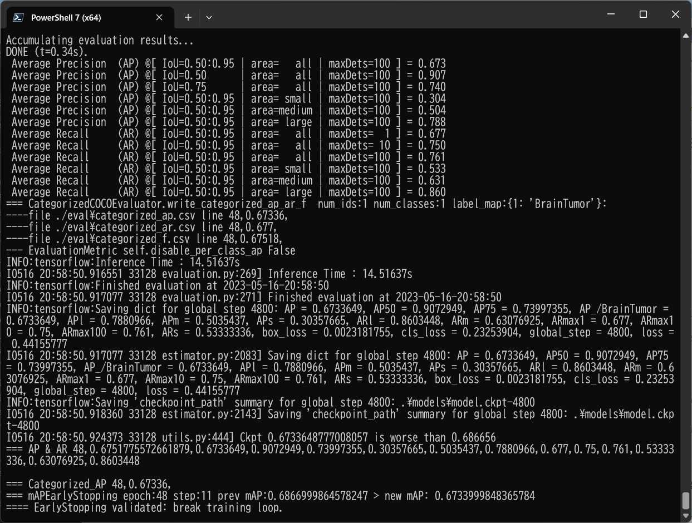
 

 
<b><a href="./projects/MRI-Brain-Tumor/eval/coco_metrics.csv">COCO metrics f and map</a></b> 
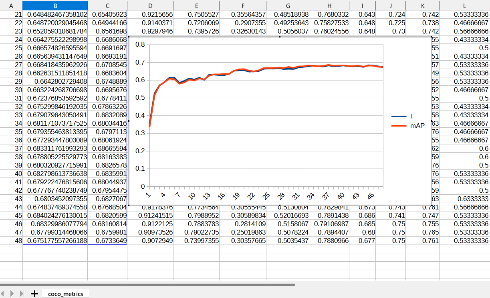
 
 
<b><a href="./projects/MRI-Brain-Tumor/eval/train_losses.csv">Train losses</a></b> 
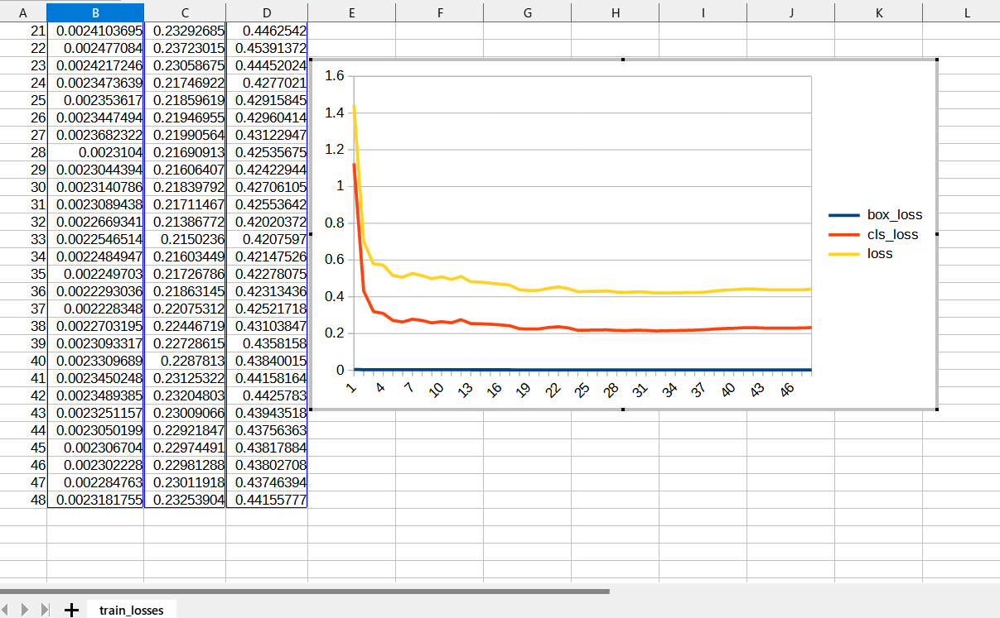
 
 

<h3>
4. Create a saved_model from the checkpoint
</h3>
  Please run the following bat file to create a saved_model from the checkpoint files in <b>./models</b> folder.  
<pre>
2_create_saved_model.bat
</pre>
, which is the following:
<pre>
rem 2_create_saved_model.bat  
python ../../SavedModelCreator.py ^
  --runmode=saved_model ^
  --model_name=efficientdet-d0 ^
  --ckpt_path=.\models  ^
  --hparams="image_size=512x512,num_classes=1" ^
  --saved_model_dir=.\saved_model
</pre>

<table style="border: 1px solid #000;">
<tr>
<td>--runmode</td><td>saved_model</td>
</tr>

<tr>
<td>--model_name </td><td>efficientdet-d0 </td>
</tr>

<tr>
<td>--ckpt_path</td><td>.\models</td>
</tr>

<tr>
<td>--hparams</td><td>"image_size=512x512,num_classes=1"</td>
</tr>

<tr>
<td>--saved_model_dir</td><td>.\saved_model</td>
</tr>
</table>

 

<h3>
5. Inference MRI-Brain-Tumor by using the saved_model
</h3>

<h3>5.1 Inference script</h3>
 Please run the following bat file to infer MRI-Brain-Tumor of <b>test</b> dataset:
<pre>
3_inference.bat
</pre>
, which is the following:
<pre>
rem 3_inference.bat
python ../../SavedModelInferencer.py ^
  --runmode=saved_model_infer ^
  --model_name=efficientdet-d0 ^
  --saved_model_dir=.\saved_model ^
  --min_score_thresh=0.4 ^
  --hparams="num_classes=1,label_map=./label_map.yaml" ^
  --input_image=./test/*.jpg ^
  --classes_file=./classes.txt ^
  --ground_truth_json=./test/annotation.json ^
  --output_image_dir=./test_outputs
</pre>

<table style="border: 1px solid #000;">
<tr>
<td>--runmode</td><td>saved_model_infer </td>
</tr>
<tr>
<td>--model_name</td><td>efficientdet-d0 </td>
</tr>

<tr>
<td>--saved_model_dir</td><td>./saved_model </td>
</tr>

<tr>
<td>--min_score_thresh</td><td>0.4 </td>
</tr>

<tr>
<td>--hparams</td><td>"num_classes=1,label_map=./label_map.yaml"</td>
</tr>

<tr>
<td>--input_image</td><td>./test/*.jpg</td>
</tr>

<tr>
<td>--classes_file</td><td>./classes.txt</td>
</tr>

<tr>
<td>--ground_truth_json</td><td>./test/annotation.json</td>
</tr>

<tr>
<td>--output_image_dir</td><td>./test_outputs</td>
</tr>
</table>
 
<b>Inference result</b>: 

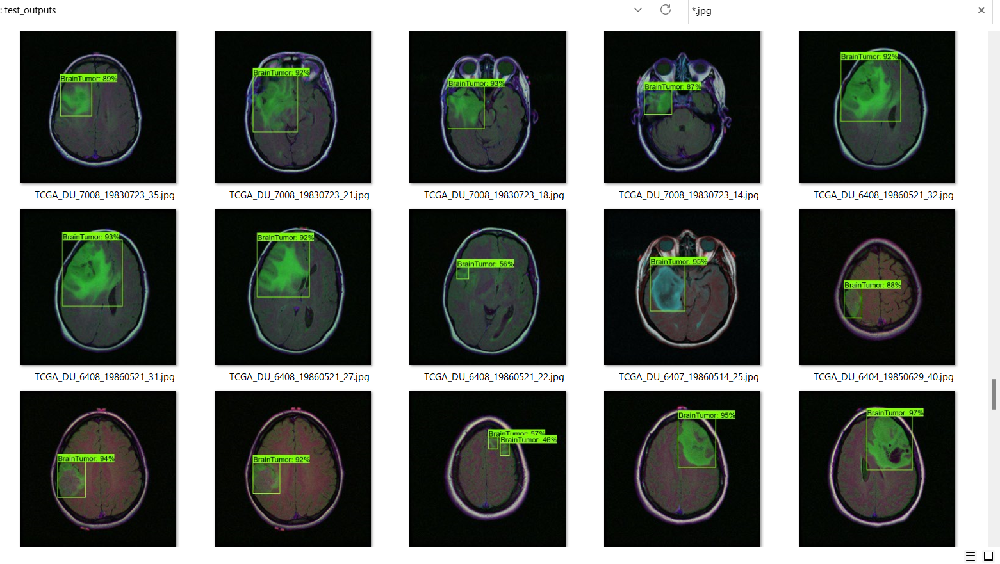 
<b>Inference mAP</b> 
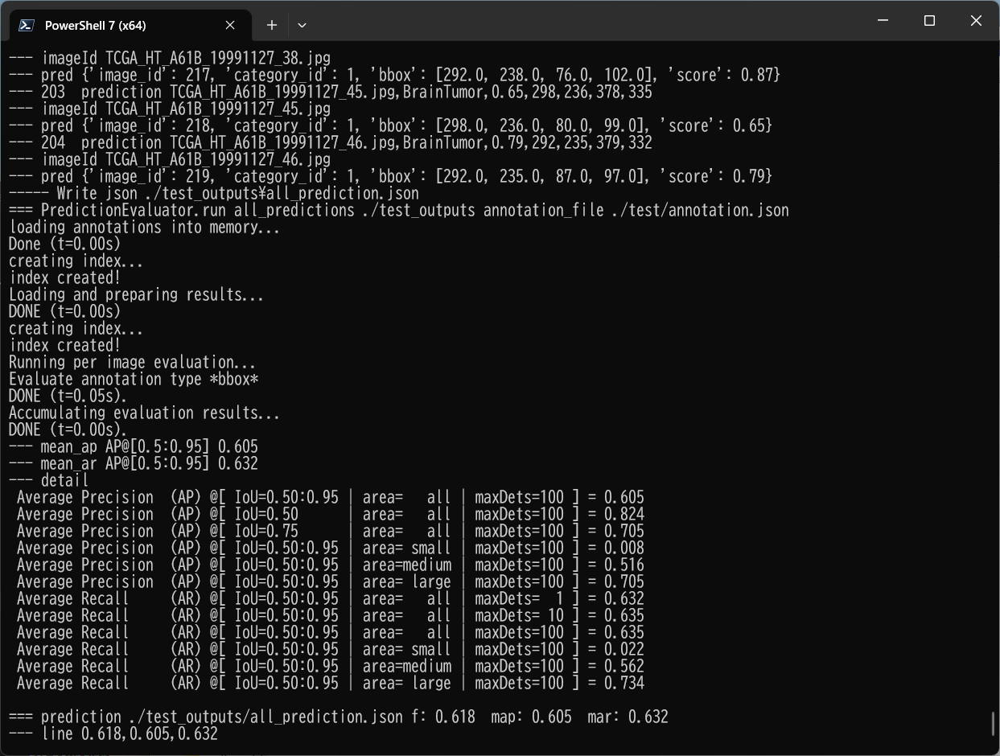 

 
<h3>

7.2. Some Inference results of MRI-Brain-Tumor
</h3>
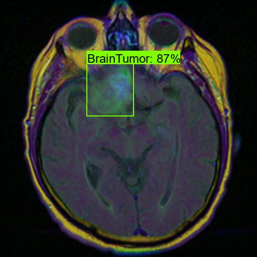 
<a href="./projects//MRI-Brain-Tumor/test_outputs/TCGA_CS_4941_19960909_11.jpg.csv">TCGA_CS_4941_19960909_11.jpg_objects.csv</a> 
 

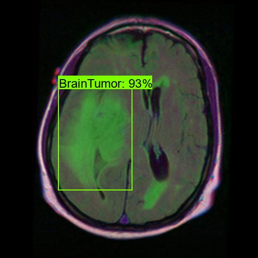 
<a href="./projects//MRI-Brain-Tumor/test_outputs/TCGA_CS_4944_20010208_12.jpg.csv">TCGA_CS_4944_20010208_12.jpg_objects.csv</a> 
 

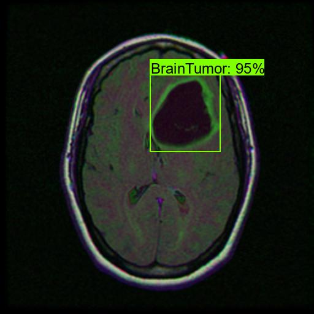 
<a href="./projects//MRI-Brain-Tumor/test_outputs/TCGA_DU_5872_19950223_36.jpg_objects.csv">TCGA_DU_5872_19950223_36.jpg_objects.csv</a> 
 

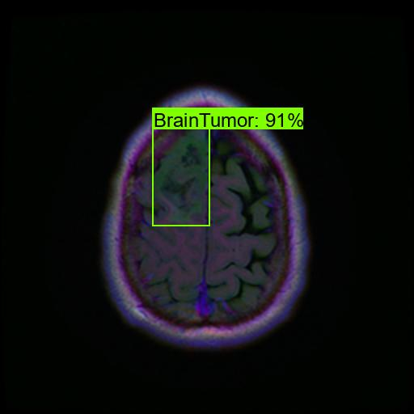 
<a href="./projects//MRI-Brain-Tumor/test_outputs/TCGA_DU_8164_19970111_30.jpg_objects.csv">TCGA_DU_8164_19970111_30.jpg_objects.csv</a> 
 

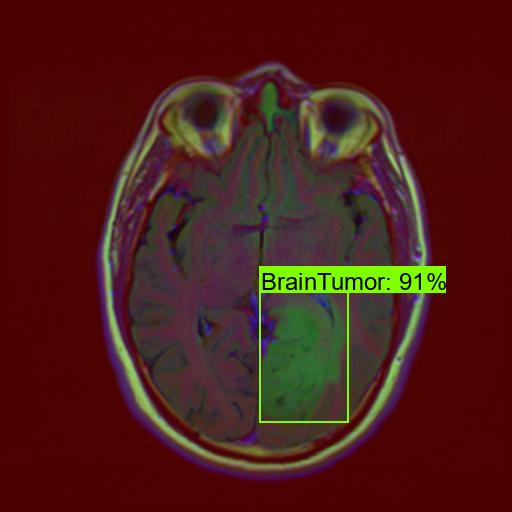 
<a href="./projects//MRI-Brain-Tumor/test_outputs/TCGA_FG_5962_20000626_24.jpg_objects.csv">TCGA_FG_5962_20000626_24.jpg_objects.csv</a> 
 

<h3>
References
</h3>

<b>1. Brain MRI segmentation</b> 
<pre>
https://www.kaggle.com/datasets/mateuszbuda/lgg-mri-segmentation
</pre>

About Dataset 
LGG Segmentation Dataset 
Dataset used in: 

Mateusz Buda, AshirbaniSaha, Maciej A. Mazurowski "Association of genomic subtypes of 
lower-grade gliomas with shape features automatically extracted by a deep learning 
algorithm." Computers in Biology and Medicine, 2019.
and
Maciej A. Mazurowski, Kal Clark, Nicholas M. Czarnek, Parisa Shamsesfandabadi, 
Katherine B. Peters, Ashirbani Saha "Radiogenomics of lower-grade glioma: 
algorithmically-assessed tumor shape is associated with tumor genomic subtypes 
and patient outcomes in a multi-institutional study with 
The Cancer Genome Atlas data." Journal of Neuro-Oncology, 2017.

This dataset contains brain MR images together with manual FLAIR abnormality 
segmentation masks.
The images were obtained from The Cancer Imaging Archive (TCIA).
They correspond to 110 patients included in The Cancer Genome Atlas (TCGA) 
lower-grade glioma collection with at least fluid-attenuated inversion recovery (FLAIR) 
sequence and genomic cluster data available.
Tumor genomic clusters and patient data is provided in data.csv file.

<b>2. Brain tumor segmentation based on deep learning and an attention mechanism using MRI multi-modalities brain images</b> 
Ramin Ranjbarzadeh, Abbas Bagherian Kasgari, Saeid Jafarzadeh Ghoushchi,  
Shokofeh Anari, Maryam Naseri & Malika Bendechache  
<pre>
https://www.nature.com/articles/s41598-021-90428-8
</pre>
<b>3. Deep learning based brain tumor segmentation: a survey</b> 
Zhihua Liu, Lei Tong, Long Chen, Zheheng Jiang, Feixiang Zhou, 
Qianni Zhang, Xiangrong Zhang, Yaochu Jin & Huiyu Zhou
 
<pre>
https://link.springer.com/article/10.1007/s40747-022-00815-5
</pre>
<b>4. MRI-based brain tumor detection using convolutional deep learning methods 
and chosen machine learning techniques</b> 
Soheila Saeedi, Sorayya Rezayi, Hamidreza Keshavarz, and Sharareh R. Niakan Kalhori
 
<pre>
https://www.ncbi.nlm.nih.gov/pmc/articles/PMC9872362/
</pre>

<b>5. Efficient framework for brain tumor detection using different deep learning techniques</b> 
Fatma Taher, Mohamed R. Shoaib, Heba M. Emara, Khaled M. Abdelwahab, Fathi E. Abd El-Samie,  
and Mohammad T. Haweel
 
<pre>
https://www.ncbi.nlm.nih.gov/pmc/articles/PMC9752904/
</pre>

<b>6. Image-Segmentation-Brain-Tumor</b> 
Toshiyki Arai @antillia.com 
<pre>
https://github.com/atlan-antillia/Image-Segmentation-Brain-Tumor
</pre>